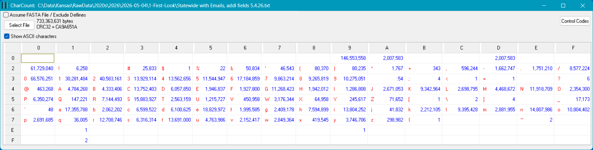

---
output:
  html_document:
    code_download: true
    theme: cerulean
    toc: yes
    toc_depth:  3
    toc_float:
      collapsed:  yes
      smooth_scroll: yes
    number_sections: yes
    code_folding:  show
    keep_md: yes

params:
  STATE:              "Kansas"
  ELECTION_DATE:      "2026-08-04"   # Primary
  VOTER_FILE_DATE:    "2026-05-04"
  RAW_VOTER_FILE:     "Statewide with Emails, addl fields 5.4.26.txt"
  UPDATED_VOTER_FILE: "Kansas-Updated.txt"
  COUNTS_DIR:         "Counts"

title:  "Kansas Voter Registration File - `r params$VOTER_FILE_DATE`"
author: "Earl F Glynn"
date:   "<small>`r Sys.Date()`</small>"
---

```{r setup, echo = FALSE}
# http://biostat.mc.vanderbilt.edu/wiki/Main/KnitrHtmlTemplate
require(Hmisc)    # provides knitrSet and other functions
knitrSet(lang = 'markdown',   # If using blogdown: knitrSet(lang='blogdown')
         fig.align = 'left',
         w = 6.5,
         h = 4.5,
         cache = FALSE)
```

`r hidingTOC(buttonLabel = "Outline")`

```{r setup2, include = FALSE}
knitr::opts_chunk$set(
  echo = TRUE,
  comment    = NA)

time.1 <- Sys.time()
```

Script to perform quality checks and to produce frequency counts of fields in the Kansas voter registration file.

**History**

* Convert very old R script to markdown and tidyverse | 2019-01-26

* Check for Geary County "tab problem" removed after problem since 2006 | 2026-01-12

**Output Files**

**State**

* `Kansas-Fixed.txt`   - fix tab problem, header consistency

* `Kansas-Updated.txt` - add additional useful variables for analysis


* `Kansas-Counts-Age-yyyy-mm-dd.xlsx`

* `Kansas-Counts-State-yyyy-mm-dd.xlsx`

* `Kansas-Crosstab-BirthYear-by-BirthMonth-yyyy-mm-dd.xlsx`

* `Kansas-Crosstab-RegisterYear-by-RegisterMonth-yyyy-mm-dd.xlsx`

* `Kansas-Registrations-By-Year-and-Month-yyyy-mm-dd.svg`


* `Kansas-Explore-Name-Duplicates-yyyy-mm-dd.xlsx`

* `Kansas-Households-Address-to-Explore-for-Many-Voters-yyyy-mm-dd.xlsx`

* `Kansas-Households-Mail-to-Explore-for-Many-Voters-yyyy-mm-dd.xlsx`


**County**

* `Kansas-Counts-County-yyyy-mm-dd.xlsx`

* `Kansas-County-Voter-Election-Code-Summary-yyyy-mm-dd.xlsx`


**Precinct**

* `Kansas-Counts-Precinct-yyyy-mm-dd.xlsx`


**Voter**

* `Kansas-Election-Codes-by-Voter-yyyy-mm-dd.txt`

* `Kansas-Explore-Name-Duplicates-yyyy-mm-dd.xlsx`

* `Kansas-Voters-Missing-District-Info-yyyy-mm-dd.xlsx`


**Election Code**

* `Election-Codes-yyyy-mm-dd.xlsx`    [Move to `Voter-Election-Codes-0-Setup`]


**Data Fields**

* `Kansas-Field-Length-Summary-yyyy-mm-dd.xlsx`

* `Counts` folder with CSV file of frequency counts for each of ~90 fields

# Backstage {.tabset .tabset-fade .tabset-pills}

## {.active}

## Constants

```{r}
EXCEL_LIMIT <- 2^20
```

Use 5-year census intervals (except for interval 18-19)

```{r}
ageBreaks <- 5 * 3:17
ageBreaks[1] <- 18
```

 [1]  18  20  25  30  35  40  45  50  55  60  65  70  75  80  85

```{r}
ageIntervals <-
  c(paste(ageBreaks[-length(ageBreaks)], ageBreaks[-1]-1, sep = "-"),
    paste0(ageBreaks[length(ageBreaks)], "+"))
ageIntervals[1] <- "18-19"
```

 [1] "18-19" "20-24" "25-29" "30-34" "35-39" "40-44" "45-49" "50-54" "55-59" "60-64"
[11] "65-69" "70-74" "75-79" "80-84" "85+"


## Packages

```{r}
library(tidyverse)
library(writexl)
library(kableExtra)
```

```{r}
library(stringi)     # stri_enc_toutf8
library(lubridate)   # date/time functionsrlang
library(gplots)      # heatmap.2
library(scales)      # comma
```

## Helper Function

```{r Helpers}
Show <- function(data, caption="", bigMark="",
                 height = NULL, width = NULL, ...)
{
  data                                       |>
  kable("html", caption=caption,
        format.args=list(big.mark=bigMark))  |>
  kable_styling(bootstrap_options=c("striped", "bordered", "condensed"),
                position="left",
                full_width=FALSE, ...)       |>
  scroll_box(height = height, width = width)
}
```

## ggplot theme

```{r ggplotTheme}
theme_set(theme_minimal() +

          theme(axis.text             = element_text(size = 10),
                axis.title            = element_text(size = 14),

                legend.position       = "bottom",

                plot.title            = element_text(color = "steelblue1",  size = 16, face = "bold"),
                plot.caption          = element_text(hjust = c(0.0,1.0),
                                                     size = 10),
                plot.caption.position = "plot",

                plot.title.position   = "plot",

                strip.background      = element_rect(fill = "aliceblue"),
                strip.text            = element_text(size = 14),

                title                 = element_text(size = 14)))

COLOR_BAR     <- "skyblue"
COLOR_OUTLINE <- "grey80"
```

## County Info

```{r}
CountyLabel <-
  tibble(
    County = c(
      'Allen',      'Anderson',    'Atchison',    'Barber',      'Barton',      'Bourbon',
      'Brown',      'Butler',      'Chase',       'Chautauqua',  'Cherokee',    'Cheyenne',
      'Clark',      'Clay',        'Cloud',       'Coffey',      'Comanche',    'Cowley',
      'Crawford',   'Decatur',     'Dickinson',   'Doniphan',    'Douglas',     'Edwards',
      'Elk',        'Ellis',       'Ellsworth',   'Finney',      'Ford',        'Franklin',
      'Geary',      'Gove',        'Graham',      'Grant',       'Gray',        'Greeley',
      'Greenwood',  'Hamilton',    'Harper',      'Harvey',      'Haskell',     'Hodgeman',
      'Jackson',    'Jefferson',   'Jewell',      'Johnson',     'Kearny',      'Kingman',
      'Kiowa',      'Labette',     'Lane',        'Leavenworth', 'Lincoln',     'Linn',
      'Logan',      'Lyon',        'Marion',      'Marshall',    'McPherson',   'Meade',
      'Miami',      'Mitchell',    'Montgomery',  'Morris',      'Morton',      'Nemaha',
      'Neosho',     'Ness',        'Norton',      'Osage',       'Osborne',     'Ottawa',
      'Pawnee',     'Phillips',    'Pottawatomie','Pratt',       'Rawlins',     'Reno',
      'Republic',   'Rice',        'Riley',       'Rooks',       'Rush',        'Russell',
      'Saline',     'Scott',       'Sedgwick',    'Seward',      'Shawnee',     'Sheridan',
      'Sherman',    'Smith',       'Stafford',    'Stanton',     'Stevens',     'Sumner',
      'Thomas',     'Trego',       'Wabaunsee',   'Wallace',     'Washington',  'Wichita',
      'Wilson',     'Woodson',     'Wyandotte'),

    CountyAbbr =  c(
      'AL', 'AN', 'AT', 'BA', 'BT', 'BB', 'BR', 'BU', 'CS', 'CQ', 'CK', 'CN',
      'CA', 'CY', 'CD', 'CF', 'CM', 'CL', 'CR', 'DC', 'DK', 'DP', 'DG', 'ED',
      'EK', 'EL', 'EW', 'FI', 'FO', 'FR', 'GE', 'GO', 'GH', 'GT', 'GY', 'GL',
      'GW', 'HM', 'HP', 'HV', 'HS', 'HG', 'JA', 'JF', 'JW', 'JO', 'KE', 'KM',
      'KW', 'LB', 'LE', 'LV', 'LC', 'LN', 'LG', 'LY', 'MN', 'MS', 'MP', 'ME',
      'MI', 'MC', 'MG', 'MR', 'MT', 'NM', 'NO', 'NS', 'NT', 'OS', 'OB', 'OT',
      'PN', 'PL', 'PT', 'PR', 'RA', 'RN', 'RP', 'RC', 'RL', 'RO', 'RH', 'RS',
      'SA', 'SC', 'SG', 'SW', 'SN', 'SD', 'SH', 'SM', 'SF', 'ST', 'SV', 'SU',
      'TH', 'TR', 'WB', 'WA', 'WS', 'WH', 'WL', 'WO', 'WY')
  )
```


# Character Quality Check

Check for unusual characters using `CharCount` utility from [github](https://github.com/EarlGlynn/CharacterCount).  This shows the count of the 256 possible 8-bit bytes in the file.  Look for changes from recent files.

The `CharCount` table will confirm whether the field separator is a tab (x09) vs a comma (x2C), and identify possible problem characters

Screen shot of running CharCount is saved to file `CharCount.png` for inclusion here.

```{r, out.width="1500px", echo=FALSE}

```

The number of problem characters is now fairly low compared to past years.

Problems can include x'E1' and x'F1'.  Failure to fix these characters can cause problems.

See use of `iconv` below.

# Raw data file

## Parameters

```{r}
cat("Raw Data: ",       params$RAW_VOTER_FILE,
    "\nUpdated File: ", params$UPDATED_VOTER_FILE,
    "\nElection Date (for age computations): ", params$ELECTION_DATE, "\n")
```

## Delimiter Check

The Kansas statewide file has had problems in the parsability of records for various reasons for many years.

The Geary County "tab problem" from 2006 was finally resolved in 2025.

So, let's check that are records parse consistently.

Parameters to `count.fields`:

* Without `comment.char` override, records with # characters are problems.

* Without `quote` override, records with apostrophes or quotation marks are problems.

```{r}
counts <- tibble(fieldCounts = count.fields(params$RAW_VOTER_FILE,
                                            sep="\t",
                                            comment.char="",
                                            quote=""))
```

```{r}
freqCounts <-
  counts                                |>
  group_by(fieldCounts)                 |>
  summarize(n = n(), .groups = "drop")  |>
  ungroup()

freqCounts |>
    Show(bigMark = ",")
```

For unknown reasons, the Kansas voter file has a header that is tab separated, but data records with fields that are tab terminated.

R complains about this mismatch.  Currently, R will add the extra separator to the end of the last field of the record, which will need to be fixed.

## Read fixed file

```{r}
voters <- read_delim(params$RAW_VOTER_FILE, "\t",
                     quote = "",
                     comment = "",
                     na = character(),  # some people might have names of "NA"
                     col_types = cols(.default = "c"),
                     progress = FALSE)

dim(voters)
```

Caused by "terminator" vs separator:

```
Warning: One or more parsing issues, call `problems()` on your data frame for details, e.g.:
  dat <- vroom(...)
  problems(dat)
```

R now leaves the extra tab "separator" as part of the last data field

```{r}
voters[1:3, ncol(voters)]
```

Remove unwanted, extra separator in last column

```{r}
voters <-
  voters |>
  mutate(district_sd = str_replace(district_sd, "\\t", ""))
```

```{r}
voters[1:3, ncol(voters)]
```

```{r}
glimpse(voters)
```

### Parties

Verify current political parties (new ones added in 2024):

Recode missing party to `Unaffiliated`

```{r}
table(voters$desc_party, useNA = "ifany")
```

### Genders

Verify some records have missing genders. Recode missing gender to `U`in cleanup below.

```{r}
table(voters$cde_gender, useNA = "ifany")
```

# Cleanup / Fixups / Add new variables

Osage County congressional district problems from 2024-2025 fixed in 2026.

## Wrong State Senate District

* Wilson County KS0014 → KS0012

```{r}
voters |>
  filter(db_logid %in% c("Wilson")) |>
  group_by(db_logid)   |>
  count(district_ks )  |>
  Show()
```

### Wilson County

[Senate District 12](https://kslegislature.gov/li/s/pdf/district_maps/district_map_s_012.pdf) map shows it contains Wilson County]

[Senate District 14](https://kslegislature.gov/li/s/pdf/district_maps/district_map_s_014.pdf) does not contain Wilson County.


```{r}
target <- which(voters$db_logid == "Wilson")
voters$district_ks[target] <- "KS0012"
length(target)
```

Verify fix

```{r}
voters |>
  filter(db_logid %in% c("Wilson")) |>
  group_by(db_logid)   |>
  count(district_ks )  |>
  Show()
```

## troubleshoot

verify fix

```
1 "Ren\xe1"        FALSE
```

```{r}
voters |>
  select(text_name_middle) |>    # verify fix
  mutate(
          text_name_middle = stri_enc_toutf8(text_name_middle, validate = FALSE),
          text_name_middle = str_squish(text_name_middle),
          is_valid_utf8    = stri_enc_isutf8(text_name_middle)
        )  |>
  filter(!is_valid_utf8 | is.na(is_valid_utf8)) |>
  print()
```


```
  text_name_last        is_valid_utf8
  <chr>                 <lgl>
1 "Arreola-P\xe9rez"    FALSE
2 "Hipolito Brise\xf1o" FALSE
3 "Salda\xf1a-Tovar"    FALSE
```


```{r}
voters |>
  select(text_name_last)                      |>
  mutate(
          text_name_last = stri_enc_toutf8(text_name_last, validate = FALSE),
          text_name_last = str_squish(text_name_last),
          is_valid_utf8  = stri_enc_isutf8(text_name_last)
        )  |>
  filter(!is_valid_utf8 | is.na(is_valid_utf8)) |>
  print()
```

## Other cleanup

Problem names

```{r}
voters |>
  filter(!stri_enc_isutf8(text_name_middle)) |>
  pull(text_name_middle)
```

```{r}
voters |>
  filter(!stri_enc_isutf8(text_name_last)) |>
  pull(text_name_last)
```

Get rid of leading/trailing/extra blanks in many fields.  Should be fixed in state file.

```{r}
x <-
  voters |>
  rename(County = db_logid)           |>   # `County` should never have been `db_logid`
  inner_join(CountyLabel, by = "County") |>
  relocate(CountyAbbr, .after = County)
```


```{r}
votersModified <-
  voters                                 |>
  rename(County = db_logid)              |>   # `County` should never have been `db_logid`
  inner_join(CountyLabel, by = "County") |>
  relocate(CountyAbbr, .after = County)  |>   # add county abbreviation
  mutate(
          cde_registrant_status       = str_trim(cde_registrant_status) |>
                                        str_to_upper(),  # Lower case happened once

          # many fields have leading blanks to trim -- should probably trim all fields
          cde_name_title              = str_trim(cde_name_title),
          text_name_first             = str_squish(text_name_first),

                                        # Total kludge here.  Problems shown above
          text_name_middle            =  stri_enc_toutf8(text_name_middle, validate = FALSE) |>
                                         str_squish(),

          text_name_last              = stri_enc_toutf8(text_name_last, validate = FALSE)    |>
                                        str_squish(),

          cde_name_suffix             = str_trim(cde_name_suffix),

          registrant_text_email       = str_trim(registrant_text_email),

          text_res_address_nbr        = str_trim(text_res_address_nbr),
          text_res_address_nbr_suffix = str_trim(text_res_address_nbr_suffix),
          cde_street_dir_prefix       = str_trim(cde_street_dir_prefix),
          text_street_name            = str_squish(text_street_name),
          cde_street_type             = str_trim(cde_street_type),
          cde_street_dir_suffix       = str_trim(cde_street_dir_suffix),
          cde_res_unit_type           = str_trim(cde_res_unit_type),
          text_res_unit_nbr           = str_trim(text_res_unit_nbr),
          text_res_zip5               = str_trim(text_res_zip5),
          text_res_zip4               = str_trim(text_res_zip4),

          text_mail_address1          = str_squish(text_mail_address1),  # also remove extra internal spaces
          text_mail_address2          = str_squish(text_mail_address2),
          text_mail_address3          = str_squish(text_mail_address3),
          text_mail_address4          = str_squish(text_mail_address4),
          text_mail_city              = str_squish(text_mail_city),
          cde_mail_state              = str_trim(cde_mail_state),
          text_mail_zip5              = str_trim(text_mail_zip5),
          text_mail_zip4              = str_trim(text_mail_zip4),

          text_res_carrier_rte        = str_trim(text_res_carrier_rte),
          text_mail_carrier_rte       = str_trim(text_mail_carrier_rte),

          text_phone_exchange         = str_trim(text_phone_exchange),
          text_phone_last_four        = str_trim(text_phone_last_four),

          text_election_code_1        = str_trim(text_election_code_1),
          text_election_code_2        = str_trim(text_election_code_2),
          text_election_code_3        = str_trim(text_election_code_3),
          text_election_code_4        = str_trim(text_election_code_4),
          text_election_code_5        = str_trim(text_election_code_5),
          text_election_code_6        = str_trim(text_election_code_6),
          text_election_code_7        = str_trim(text_election_code_7),
          text_election_code_8        = str_trim(text_election_code_8),
          text_election_code_9        = str_trim(text_election_code_9),
          text_election_code_10       = str_trim(text_election_code_10),
          polling_place_text_zip5     = str_trim(polling_place_text_zip5),
          polling_place_text_zip4     = str_trim(polling_place_text_zip4),
          district_jd                 = str_trim(district_jd),
          district_sd                 = str_trim(district_sd),

          text_res_physical_address = str_trim(text_res_physical_address),

          ## Add useful derived fields
          phone                     = paste(text_phone_area_code,
                                            text_phone_exchange,
                                            text_phone_last_four, sep = "-"),
          cde_gender                = str_trim(cde_gender),
          cde_gender                = recode(
                                             cde_gender,
                                             .missing = "U"
                                            ),

          desc_party                = if_else(desc_party  == "",    # Missing -> "Unaffilated"
                                              "Unaffiliated",
                                              str_trim(desc_party)),
          desc_party                = recode(desc_party,
                                             .missing = "Unaffiliated"),

          Party                     = case_match(desc_party,
                                                  "Democratic"       ~ "D",
                                                  "Libertarian"      ~ "L",
                                                  "No Labels Kansas" ~ "N",   # new in 2024
                                                  "Republican"       ~ "R",
                                                  "Unaffiliated"     ~ "U",
                                                  "United Kansas"    ~ "K"    # new in 2024
                                                ),

          commissioner =paste0(CountyAbbr, "-", district_cc),   # Make unique statewide

          precinct_text_designation = str_trim(precinct_text_designation),
          precinct_text_name        = str_trim(precinct_text_name),  # needed for some counties
          precinct                  = paste(CountyAbbr,              # Make unique statewide
                                            precinct_text_name, precinct_text_designation,
                                            sep = "|"),

          precinct_part_text_designation = str_trim(precinct_part_text_designation),
          precinct_part_text_name        = str_trim(precinct_part_text_name),
          precinctPart                   = paste(CountyAbbr, precinct_part_text_name,
                                                 precinct_part_text_designation, sep = "|"),

          # Kansas voter roll often has 100+ near-duplicate name entries, often at the same address.
          nameHash = paste(   # used to be hash, but now let's use verbose string
                            CountyAbbr,
                            text_name_last,
                            text_name_first,
                            text_name_middle,
                            cde_name_suffix,
                            cde_gender,
                            mdy(date_of_birth),
                            sep = "|"
                           ),

          # Households
          addressHousehold = paste(CountyAbbr,
                                   text_res_city,
                                   text_res_zip5,
                                   text_res_address_nbr,
                                   text_res_address_nbr_suffix,
                                   cde_street_dir_prefix, text_street_name, cde_street_type,
                                   cde_res_unit_type, text_res_unit_nbr,
                                   text_res_zip4,
                                   sep = "|"),
          mailHousehold    = paste(
                                   text_mail_city,
                                   text_mail_zip5,
                                   text_mail_address1,
                                   text_mail_address2,
                                   text_mail_address3,
                                   text_mail_address4,
                                   cde_mail_state,
                                   text_mail_zip4,
                                   sep = "|"),

          # Registration
          RegisterDate     = mdy(date_of_registration),
          RegisterYear     = lubridate::year(RegisterDate),       # Use for cleanup
          RegisterMonth    = lubridate::month(RegisterDate),
          Registered       = (RegisterDate %--% lubridate::ymd(params$ELECTION_DATE)) / years(1),

          # Birthdate / Age
          BirthDate        = mdy(date_of_birth),
          BirthYear        = lubridate::year(BirthDate),          # Use for cleanup
          BirthMonth       = lubridate::month(BirthDate),
          Age              = round((BirthDate %--% lubridate::ymd(params$ELECTION_DATE)) / years(1)),
          AgeInterval      = cut(Age,
                                 breaks = c(ageBreaks, Inf),
                                 right = FALSE,
                                 labels = ageIntervals),
          AgeRegistered    = round( as.numeric( mdy(date_of_registration)  -
                                                mdy(date_of_birth) ) / 365.25, 2),

          DayOfLeapYear    = paste0( str_sub(date_of_birth, 1, 6),  "2024" ) |> mdy() |>  yday()  # Fairly random distribution?
        )

dim(votersModified)
write_tsv(votersModified, params$UPDATED_VOTER_FILE)
```

```{r}
save(votersModified,
     file = paste0(params$STATE, "-Voters-Updated-", params$VOTER_FILE_DATE, ".rda"))
```

# Stats for State

## Status

```{r}
table(votersModified$cde_registrant_status, useNA = "ifany")
```

## Party

```{r}
table(votersModified$desc_party, useNA = "ifany")
```

```{r}
table(votersModified$Party, useNA = "ifany")
```

## Gender

```{r}
table(votersModified$cde_gender, useNA = "ifany")
```

## Age

### Too young?

BirthDate needed to be 18 on election day

```{r}
ymd(params$ELECTION_DATE) - years(18)
```

```{r}
tooYoung <-
  votersModified |>
  filter(BirthDate > ymd(params$ELECTION_DATE) - years(18))

if (nrow(tooYoung) > 0)
{
  write_xlsx(tooYoung,
             paste0(params$STATE, "-Age-Too-Young-", params$VOTER_FILE_DATE, ".xlsx"))
}

dim(tooYoung)
```

BirthDate range for too young

```{r}
c( min(tooYoung$BirthDate), min(tooYoung$BirthDate))
```

### Stats

```{r}
fivenum(votersModified$Age)
```

```{r}
table(votersModified$Age, useNA = "ifany")
```

```{r}
ageCounts <-
  votersModified |>
  count(Age)
```

```{r}
write_xlsx(ageCounts,
           paste0(params$STATE, "-Counts-Age-", params$VOTER_FILE_DATE, ".xlsx"))
```

### Too old?

```{r}
TOO_OLD <- 105

ageCounts |>
  filter(Age >= TOO_OLD)  |>
  Show(height = "300px")
```

```{r}
tooOld <-
  votersModified |>
  filter(Age >= TOO_OLD)

if (nrow(tooOld) > 0)
{
  write_xlsx(tooOld,
             paste0(params$STATE, "-Age-Too-Old-", params$VOTER_FILE_DATE, ".xlsx"))
}

dim(tooOld)
```

Breakdown by County

```{r}
tooOldByCounty <-
  tooOld                        |>
  group_by(County, CountyAbbr)  |>
  count()

nrow(tooOldByCounty)
```

```{r}
tooOldByCounty |>
  arrange(-n)  |>
  Show()
```

```{r}
if (nrow(tooOldByCounty) > 0)
{
  write_xlsx(tooOldByCounty,
             paste0(params$STATE, "-Age-Too-Old-By-County-", params$VOTER_FILE_DATE, ".xlsx"))
}
```

## Summary

```{r}
countsState <-
  votersModified  |>
  summarize(
             n             = n(),
             Voters        = n_distinct(text_registrant_id),

             AgeMin         = min(Age, na.rm = TRUE),                      # Age
             AgeQ25         = quantile(Age, 0.25, na.rm = TRUE),
             AgeMedian      = median(Age, na.rm = TRUE),
             AgeQ75         = quantile(Age, 0.75, na.rm = TRUE),
             AgeQ999        = quantile(Age, 0.999, na.rm = TRUE),
             AgeMax         = max(Age, na.rm = TRUE),

             nCounty       = n_distinct(County),
             nCommissioner = n_distinct(commissioner),                     # Districts

             nCongress      = n_distinct(district_cg),
             nKSSenate      = n_distinct(district_ks),
             nKSHouse       = n_distinct(district_kr),
             nKSStateBoard  = n_distinct(district_sb),
             nKSSchoolBoard = n_distinct(district_sd),

             City           = n_distinct(text_res_city),
             Zip            = n_distinct(text_res_zip5),

             Precinct       = n_distinct(precinct),
             PrecinctPart   = n_distinct(precinctPart),

             Email          = n_distinct(registrant_text_email),
             Phone          = n_distinct(phone),

             AddressHousehold = n_distinct(addressHousehold),
             MailHousehold    = n_distinct(mailHousehold),

             Female         = sum(cde_gender == "F", na.rm = TRUE),        # Gender
             Male           = sum(cde_gender == "M", na.rm = TRUE),
             Unknown        = sum(cde_gender == "U", na.rm = TRUE),
             PercentFemale     = round(100 * Female / Voters, 2),
             PercentMale       = round(100 * Male / Voters, 2),
                                                                           # Party
             Democratic     = sum(desc_party == "Democratic",       na.rm = TRUE),
             Republican     = sum(desc_party == "Republican",       na.rm = TRUE),
             Libertarian    = sum(desc_party == "Libertarian",      na.rm = TRUE),
             NoLabels       = sum(desc_party == "No Labels Kansas", na.rm = TRUE),
             UnitedKansas   = sum(desc_party == "United Kansas",    na.rm = TRUE),
             Unaffiliated   = sum(desc_party == "Unaffiliated"    , na.rm = TRUE),
             PercentDemocratic = round(100 * Democratic / Voters, 2),
             PercentRepublican = round(100 * Republican / Voters, 2),

             Active            = sum(cde_registrant_status == "A"),        # Status
             Inactive          = sum(cde_registrant_status == "I"),
             PercentInactive   = round(100 * Inactive / (Active + Inactive), 2),

             Jan1Percent       = round(100 * sum(DayOfLeapYear == 1) / Voters, 3)
           )

countsState |> Show(bigMark = ",")
write_xlsx(countsState, paste0(params$STATE, "-Counts-State-", params$VOTER_FILE_DATE, ".xlsx"))
```

## Crosstabs

### `date_of_registration`:  Year by Month

```{r}
byYearMonth <-
  votersModified                         |>
  select(RegisterYear, RegisterMonth)    |>
  group_by(RegisterYear, RegisterMonth)  |>
  count()                                |>
  arrange(RegisterYear, RegisterMonth)   |>
  collect()                              |>
  spread(RegisterMonth, n, fill = 0)     |>
  ungroup()

dim(byYearMonth)
```

```{r}
write_xlsx(byYearMonth, paste0(params$STATE, "-Crosstab-RegisterYear-by-RegisterMonth-", params$VOTER_FILE_DATE, ".xlsx"))
```

```{r}
byYearMonth |> Show(height = "400px")
```

Future Registrations?

```{r}
if (month(params$VOTER_FILE_DATE) == 12)
{ 
  futureCutoff <- ymd( paste(year(params$VOTER_FILE_DATE) + 1, 1, 1 ) )
} else {
  futureCutoff <- ymd( paste(year(params$VOTER_FILE_DATE), month(params$VOTER_FILE_DATE) + 1, 1 ) )
}

futureRegistrations  <-
  votersModified  |>
  select(-cde_name_title)  |> 
  filter(RegisterDate >= futureCutoff) |>
  relocate(date_of_registration, .after = "cde_registrant_status")

nrow(futureRegistrations)
if (nrow(futureRegistrations) > 0)
{
  write_xlsx(futureRegistrations, paste0(params$STATE, "-Registrations-with-Future-Date-", params$VOTER_FILE_DATE, ".xlsx"))
}
```


Graphic

```{r}
startYear <- 2010
endYear   <- 2026            #####

byYearMonthRegister <-
  byYearMonth |>
  select(RegisterYear, `1`:`12`)   |>
  filter(RegisterYear >= startYear,
         RegisterYear <= endYear)
```

```{r}
colorPalette <- colorRampPalette(c("lemonchiffon", "yellow2", "yellow1", "gold"))
lmat <- rbind( c(0, 3, 3),  # layout matrix
               c(2, 1, 1),
               c(0, 0, 4))
lwid <- c(0.5, 4, 4)        # entry fo r each column in layout matrix
lhei <- c(1, 5, 1)          # entry for each row in layout matrix
yearMonthMatrix <- as.matrix(data.frame(byYearMonthRegister, row.names=1))
```

```{r Registrations-By-Year-and-Month, fig.width = 11, fig.height = 8}
svg(paste0(params$STATE,
           "-Registrations-By-Year-and-Month-",
           params$VOTER_FILE_DATE,
           ".svg"),
    width = 10, height =8, pointsize = 14)

options(scipen=999)  # suppress scientific notation in legend

heatmap.2(yearMonthMatrix,  # must be matrix
          cellnote = yearMonthMatrix,   # same data for cell labels
          main = paste0("Counts of Registration Dates of Kansas Voters by Year and Month (",
                        startYear, " - ", endYear, ")\n",
                        "For Registered Voters in ",
                         strftime(ymd(params$VOTER_FILE_DATE), "%B %Y")),
          notecol = "black",        # change font color of cell labels to black
          density.info = "none",    # turns off density plot inside color legend
          trace = "none",           # turns off trace lines inside the heat map
          dendrogram = "none",      # suppress row and column dendrograms
          Colv = NA,                # suppress reordering
          Rowv = NA,                # suppress reordering
          key.title = NA,           # suppress title
          key.xlab = NA,            # suppress key x-axis label
          cexRow  = 1.75,
          cexCol  = 2,
          notecex = 1.4,
          col = colorPalette,
          labCol = month.abb, srtCol=0, adjCol=0.5,
          lmat = lmat, lwid = lwid, lhei = lhei
)

mtext(paste0("Source:  Kansas Secretary of State voter file, ", params$VOTER_FILE_DATE), 1,
        adj = 0.12, col = "blue", outer = TRUE, cex = 1.0, line = -2)
mtext(paste0("Based on Registration Dates of ", comma(nrow(voters)), " voters"), 1,
        adj = 0.21, col = "blue", outer = TRUE, cex = 0.8, line = -1)

dev.off()
```

### `date_of_birth`:  Year by Month

```{r}
byYearMonthAge <-
  votersModified                   |>
  select(BirthYear, BirthMonth)    |>
  group_by(BirthYear, BirthMonth)  |>
  count()                          |>
  arrange(BirthYear, BirthMonth)   |>
  collect()                        |>
  spread(BirthMonth, n, fill = 0)  |>
  ungroup()

dim(byYearMonthAge)
```

```{r}
write_xlsx(byYearMonthAge, paste0(params$STATE, "-Crosstab-BirthYear-by-BirthMonth-", params$VOTER_FILE_DATE, ".xlsx"))
```

```{r}
byYearMonthAge |> Show(height = "400px")
```

# Stats by County

```{r}
countsCounty <-
  votersModified               |>
  group_by(County, CountyAbbr) |>
  summarize(
             Voters           = n_distinct(text_registrant_id),

             AgeMin         = min(Age, na.rm = TRUE),                      # Age
             AgeQ25         = quantile(Age, 0.25, na.rm = TRUE),
             AgeMedian      = median(Age, na.rm = TRUE),
             AgeQ75         = quantile(Age, 0.75, na.rm = TRUE),
             AgeQ999        = quantile(Age, 0.999, na.rm = TRUE),
             AgeMax         = max(Age, na.rm = TRUE),
                                                                           # Districts
             Commissioner     = district_cc |> unique() |> sort() |> str_flatten(collapse  = " | "),
             Congress         = district_cg |> unique() |> sort() |> str_flatten(collapse  = " | "),
             KSSenate         = district_ks |> unique() |> sort() |> str_flatten(collapse  = " | "),
             KSHouse          = district_kr |> unique() |> sort() |> str_flatten(collapse  = " | "),
             KSStateBoard     = district_sb |> unique() |> sort() |> str_flatten(collapse  = " | "),
             KSSchoolDistrict = district_sd |> unique() |> sort() |> str_flatten(collapse  = " | "),

             City             = n_distinct(text_res_city),
             Zip              = n_distinct(text_res_zip5),

             Precinct         = n_distinct(precinct),
             PrecinctPart     = n_distinct(precinctPart),

             Email            = n_distinct(registrant_text_email),
             Phone            = n_distinct(phone),

             AddressHousehold = n_distinct(addressHousehold),
             MailHousehold    = n_distinct(mailHousehold),

             Female           = sum(cde_gender == "F", na.rm = TRUE),    # Gender
             Male             = sum(cde_gender == "M", na.rm = TRUE),
             Unknown          = sum(cde_gender == "U", na.rm = TRUE),
             PercentFemale    = round(100 * Female / Voters, 2),
             PercentMale      = round(100 * Male / Voters, 2),

                                                                         # Party
             Democratic   = sum(desc_party == "Democratic",       na.rm = TRUE),
             Republican   = sum(desc_party == "Republican",       na.rm = TRUE),
             Libertarian  = sum(desc_party == "Libertarian",      na.rm = TRUE),
             NoLabels     = sum(desc_party == "No Labels Kansas", na.rm = TRUE),
             UnitedKansas = sum(desc_party == "United Kansas",    na.rm = TRUE),
             Unaffilated  = sum(desc_party == "Unaffiliated",     na.rm = TRUE),
             PercentDemocratic = round(100 * Democratic / Voters, 2),
             PercentRepublican = round(100 * Republican / Voters, 2),

             Active      = sum(cde_registrant_status == "A"),            # Status
             Inactive    = sum(cde_registrant_status == "I"),
             PercentInactive = round(100 * Inactive / Voters, 2),

             Jan1Percent       = round(100 * sum(DayOfLeapYear == 1) / Voters, 3)
           )

nrow(countsCounty)
```

```{r}
countsCounty  |>
  Show(bigMark = ",", height = "300px")
```

```{r}
write_xlsx(countsCounty, paste0(params$STATE, "-Counts-County-", params$VOTER_FILE_DATE, ".xlsx"))
```

## Missing district info by County

Use original, unmodified `voters` data here

```{r}
missingCongressionalDistrict <- voters$district_cg < "CG"
missingKansasRepresentative  <- voters$district_kr < "KR"
missingKansasSenate          <- voters$district_ks < "KS"
missingSchoolBoard           <- voters$district_sb < "SB"
missingCommissionerDistrict  <- voters$district_cc < "CC"
missingSchoolDistrict        <- voters$district_sd < "SD"

missingDistricts <-
  missingCongressionalDistrict |
  missingKansasRepresentative  |
  missingKansasSenate          |
  missingSchoolBoard           |
  missingCommissionerDistrict  |
  missingSchoolDistrict
```

```{r}
table(votersModified$County[missingDistricts], useNA = "ifany")
```

```{r}
table(missingCongressionalDistrict, useNA = "ifany")
```

```{r}
table(missingKansasRepresentative, useNA = "ifany")
```

```{r}
table(missingKansasSenate, useNA = "ifany")
```

```{r}
table(missingCommissionerDistrict, useNA = "ifany")
```

```{r}
table(missingSchoolDistrict, useNA = "ifany")
```

```{r}
votersMissingDistrictInfo <- voters[missingDistricts, ]
dim(votersMissingDistrictInfo)

# Some voters missing school districts have info about that in the precinct name.

if (nrow(votersMissingDistrictInfo) > 0)
{
  write_xlsx(votersMissingDistrictInfo, paste0(params$STATE, "-Voters-Missing-District-Info-", params$VOTER_FILE_DATE, ".xlsx"))
}
```

# Stats by Precinct

```{r}
countsPrecinct <-
  votersModified   |>
  group_by(County, CountyAbbr,
           precinct_text_name, precinct_text_designation, precinct) |>
  summarize(
             Voters           = n_distinct(text_registrant_id),

             AgeMin         = min(Age, na.rm = TRUE),                           # Age
             AgeQ25         = quantile(Age, 0.25, na.rm = TRUE),
             AgeMedian      = median(Age, na.rm = TRUE),
             AgeQ75         = quantile(Age, 0.75, na.rm = TRUE),
             AgeQ999        = quantile(Age, 0.999, na.rm = TRUE),
             AgeMax         = max(Age, na.rm = TRUE),
                                                                                # Districts
             Commissioner     = district_cc |> unique() |> sort() |> str_flatten(collapse  = " | "),
             Congress         = district_cg |> unique() |> sort() |> str_flatten(collapse  = " | "),
             KSSenate         = district_ks |> unique() |> sort() |> str_flatten(collapse  = " | "),
             KSHouse          = district_kr |> unique() |> sort() |> str_flatten(collapse  = " | "),
             KSStateBoard     = district_sb |> unique() |> sort() |> str_flatten(collapse  = " | "),
             KSSchoolDistrict = district_sd |> unique() |> sort() |> str_flatten(collapse  = " | "),

             City             = n_distinct(text_res_city),
             Zip              = n_distinct(text_res_zip5),

             Precinct         = n_distinct(precinct),
             PrecinctPart     = n_distinct(precinctPart),

             Email            = n_distinct(registrant_text_email),
             Phone            = n_distinct(phone),

             AddressHousehold = n_distinct(addressHousehold),
             MailHousehold    = n_distinct(mailHousehold),

             Female       = sum(cde_gender == "F", na.rm = TRUE),               # Gender
             Male         = sum(cde_gender == "M", na.rm = TRUE),
             Unknown      = sum(cde_gender == "U", na.rm = TRUE),
             PercentFemale     = round(100 * Female / Voters, 2),
             PercentMale       = round(100 * Male   / Voters, 2),

             Democratic   = sum(desc_party == "Democratic",   na.rm = TRUE),    # Party
             Republican   = sum(desc_party == "Republican",   na.rm = TRUE),
             Libertarian  = sum(desc_party == "Libertarian",  na.rm = TRUE),
             NoLabels     = sum(desc_party == "No Labels Kansas", na.rm = TRUE),
             Unaffilated  = sum(desc_party == "Unaffiliated", na.rm = TRUE),
             PercentDemocratic = round(100 * Democratic / Voters, 2),
             PercentRepublican = round(100 * Republican / Voters, 2),

             Active       = sum(cde_registrant_status == "A"),                  # Status
             Inactive     = sum(cde_registrant_status == "I"),
             PercentInactive = round(100 * Inactive / (Active + Inactive), 2),

             Jan1Percent       = round(100 * sum(DayOfLeapYear == 1) / Voters, 3),

             .groups = "drop"
           )

nrow(countsPrecinct)
write_xlsx(countsPrecinct, paste0(params$STATE, "-Counts-Precinct-", params$VOTER_FILE_DATE, ".xlsx"))
```

```{r}
countsPrecinct  |>
  head(10)      |>
  Show(bigMark = ",", height = "300px")
```

# Field Metastats

"metadata" is "data about data".   Here "metastats" are statistics on metadata.

Create COUNTS directory if it does not exist.

Explore counts files for unexpected problems, often at top and bottom of file.

```{r}
if (! file.exists(params$COUNTS_DIR))
{
  dir.create(params$COUNTS_DIR)
}
```

Look at each column and create descriptive stats of data

```{r}
nFields <- length(colnames(votersModified))

fieldSummary <-
  tibble(Index   = 1:nFields,
         Field   = rep("", nFields),
         Min     = rep(0, nFields),   # field length stats
         Q1      = rep(0, nFields),
         Median  = rep(0, nFields),
         Mean    = rep(0, nFields),
         Q3      = rep(0, nFields),
         Max     = rep(0, nFields),
         NAs     = rep(0, nFields),
         N       = rep(0, nFields),
         Missing = rep(0, nFields),
         NUnique = rep(0, nFields),
         NCounty = rep(0, nFields))
```

`tidyverse` doesn't work well (for me) in the following, so not used.

```{r}
for (i in 1 :nFields)
{
  column <- colnames(votersModified)[i]
  field  <- pull(votersModified, i)

  cat(i, column, "\n")

  counts <- table(field)
  counts <-  data.frame(as.table(counts))
  colnames(counts) <- c(column,"Count")

  COUNTSfilename <- paste0(params$COUNTS_DIR, "/",
                           sprintf("%03d",i),"-", column)


   # Excel file are easier to view, but often unusual values better found in a CSV.
   write_csv(counts,  paste0(COUNTSfilename, ".csv"))

  fieldSummary$N[i]       <- length(field) - fieldSummary$Missing[i]
  fieldSummary$NUnique[i] <- length(unique(field))

  if (class(field) == "character")
  {
    zeroLengthField <- (nchar(field) == 0)  # should trim char strings?

    # Field width stats
    fieldSummary$NCounty[i] <- length( na.omit( unique(votersModified$County[!zeroLengthField]) ))

    fieldSummary$Missing[i] <- sum(nchar(field) == 0, na.rm=TRUE)

    fieldStats <- as.vector(summary( nchar(field[!zeroLengthField]) ) )
    if (length(fieldStats) == 6)   # Make sure length with be 7
    {
      fieldStats <- c(fieldStats, 0)   # 0 NAs
    }

    fieldSummary$Index[i]   <- i
    fieldSummary$Field[i]   <- column
    fieldSummary$Min[i]     <- fieldStats[1]
    fieldSummary$Q1[i]      <- fieldStats[2]
    fieldSummary$Median[i]  <- fieldStats[3]
    fieldSummary$Mean[i]    <- fieldStats[4]
    fieldSummary$Q3[i]      <- fieldStats[5]
    fieldSummary$Max[i]     <- fieldStats[6]
    fieldSummary$NAs[i]     <- fieldStats[7]
  }
}
```

```{r}
fieldSummary |>
  Show(bigMark = ",", height = "400px")
```

```{r}
write_xlsx(fieldSummary, paste0(params$STATE, "-Field-Length-Summary-", params$VOTER_FILE_DATE, ".xlsx"))
```

## Exlore metadata problems

Missing districts (congress, county commission, school district) dealt with separately above.

### Missing first names

```{r}
missingFirst <-
  votersModified |>
  filter(nchar(text_name_first) == 0)

nrow(missingFirst)
```

```{r}
write_xlsx(missingFirst, paste0(params$STATE, "-Missing-First-Names-", params$VOTER_FILE_DATE, ".xlsx"))
```

```{r}
table(missingFirst$County, useNA = "ifany")
```

```{r}
missingStreet <-
  votersModified |>
  filter((nchar(text_res_address_nbr) == 0) |
          (nchar(text_street_name)    == 0)  )

nrow(missingStreet)
```

```{r}
table(missingStreet$County, useNA = "ifany")
```


```{r}
write_xlsx(missingStreet, paste0(params$STATE, "-Missing-Street-Number-or-Street-Name-", params$VOTER_FILE_DATE, ".xlsx"))
```

# Household Summary

The voters at any single household should be scrutinized if the number of voters is "large" at a household.

What is "large" is defined by looking at the distribution of the number of voters at a household.

Previous County and Precinct summaries show counts of households two different ways.  Each household definition has its strengths and weaknesses.

* `AdressHousehold` is simply a string containing the street address, any apartment or unit number, city and zip.  The problem with this household type is many areas can be missing apartment numbers, which would automatically split into different households. [Another options is is add a last name to the `AddressHousehold` but that can split households when relatives have different last names.]

* `maileHousehold` is like `addressHousehold` but is for the mailing address instead of the residential address

The `Counts` folder already shows frequency counts for each household type.  Let's look at the count stats and create lists of households of concern.

## Address Households

```{r}
filename <- list.files(path = params$COUNTS_DIR,
                       pattern = glob2rx("*-addressHousehold.csv"),
                       full.names = TRUE)
filename
```

```{r}
addressHousehold <- read_csv(filename, show_col_types = FALSE)
dim(addressHousehold)
```

```{r}
Qaddress <- quantile(addressHousehold$Count,
                     probs = c(0, 0.25, 0.50, 0.75, 0.90, 0.95, 0.99, 0.999, 0.9999, 1.0))
Qaddress
```

Let's go with higher than the top 0.1%

```{r}
Qaddress["99.9%"]
```

```{r}
bigHouseholds <-
  addressHousehold                  |>
  filter(Count > Qaddress["99.9%"]) |>
  unique()

nrow(bigHouseholds)
```

Stats of households with many voters

```{r}
statsAddressHousehold <-
  votersModified                                             |>
  rename(City = text_res_city, Zip5 = text_res_zip5)         |>
  inner_join(bigHouseholds, by = "addressHousehold")         |>
  group_by(County, CountyAbbr, City, Zip5, addressHousehold) |>
  summarize(
             Voters         = n_distinct(text_registrant_id),
             LastNames      = length(unique(text_name_last)),

             AgeMin         = min(Age,             na.rm = TRUE),              # Age
             AgeMedian      = median(Age,          na.rm = TRUE),
             AgeQ999        = quantile(Age, 0.999, na.rm = TRUE),
             AgeMax         = max(Age,             na.rm = TRUE),

             Female         = sum(cde_gender == "F", na.rm = TRUE),            # Gender
             Male           = sum(cde_gender == "M", na.rm = TRUE),
             Unknown        = sum(cde_gender == "U", na.rm = TRUE),
             PercentFemale  = round(100 * Female / Voters, 2),
             PercentMale    = round(100 * Male   / Voters, 2),

             Democratic   = sum(desc_party == "Democratic",   na.rm = TRUE),   # Party
             Republican   = sum(desc_party == "Republican",   na.rm = TRUE),
             Libertarian  = sum(desc_party == "Libertarian",  na.rm = TRUE),
             NoLabels     = sum(desc_party == "No Labels Kansas", na.rm = TRUE),
             Unaffilated  = sum(desc_party == "Unaffiliated", na.rm = TRUE),
             PercentDemocratic = round(100 * Democratic / Voters, 2),
             PercentRepublican = round(100 * Republican / Voters, 2),

             Active          = sum(cde_registrant_status == "A"),              # Status
             Inactive        = sum(cde_registrant_status == "I"),
             PercentInactive = round(100 * Inactive / (Active + Inactive), 2),

            .groups = "drop"
           )                  |>
  arrange(-Voters)            |>
  mutate(householdRaw = addressHousehold) |>
  separate(householdRaw,
           sep = "\\|",
           c(
               NA,              # County,
               NA,              # CountyAbbr,
               NA,              # text_res_city,
               NA,              # text_res_zip5,
               "House",         # text_res_address_nbr,
               "HouseSuffix",   # text_res_address_nbr_suffix,
               "StreetPrefix",  # cde_street_dir_prefix,+
               "StreetName",    # text_street_name,
               "StreetType",    # cde_street_type,
               "Unit",          # cde_res_unit_type,
               "UnitNumber",    # text_res_unit_nbr,
               NA               # text_res_zip4
            )
          )                                                                   |>
  mutate(Address = str_squish(
                               paste(
                                      House, HouseSuffix,
                                      StreetPrefix, StreetName, StreetType,
                                      Unit, UnitNumber
                                    )
                             )
        )                                           |>
  select(-House, -HouseSuffix,
         -StreetPrefix, -StreetName, -StreetType,
         -Unit, -UnitNumber)                        |>
  relocate(addressHousehold, .after = "Address")    |>
  relocate(Address, .after = "Zip5")

nrow(statsAddressHousehold)
```

```{r}
statsAddressHousehold |> head() |> Show()
```

```{r}
write_xlsx(statsAddressHousehold ,
           paste0(params$STATE,
                  "-Households-Address-to-Explore-for-Many-Voters-",
                  params$VOTER_FILE_DATE, ".xlsx"))
```

Counts by zip code

```{r}
counts <- table(statsAddressHousehold$Zip5)
sort(counts[counts > 3], decreasing = TRUE)
```

## Mail Households

```{r}
filename <- list.files(path = params$COUNTS_DIR,
                       pattern = glob2rx("*-mailHousehold.csv"),
                       full.names = TRUE)
filename
```

```{r}
mailHousehold <- read_csv(filename, show_col_types = FALSE)
dim(mailHousehold)
```

```{r}
Qmail <- quantile(mailHousehold$Count,
                     probs = c(0, 0.25, 0.50, 0.75, 0.90, 0.95, 0.99, 0.995, 0.999, 1.0))
Qmail
```

Let’s go with the top 0.1%

But delete the 100% limit since that is for a blank mail address

```{r}
Qmail["99.9%"]
```

```{r}
bigMailHouseholds <-
  mailHousehold   |>
  filter(Count >= Qmail["99.9%"],
         Count < Qmail["100%"]) |>
  unique()

nrow(bigMailHouseholds)
```

Stats of mail households with many voters

```{r}
statsMailAddressHousehold <-
  votersModified                                          |>
  rename(State = cde_mail_state,
         City  = text_mail_city,
         Zip5  = text_mail_zip5)                          |>
  inner_join(bigMailHouseholds, by = "mailHousehold")     |>
  group_by(State, City, Zip5, mailHousehold)      |>
  summarize(
             Voters         = n_distinct(text_registrant_id),
             LastNames      = length(unique(text_name_last)),

             AgeMin         = min(Age,             na.rm = TRUE),              # Age
             AgeMedian      = median(Age,          na.rm = TRUE),
             AgeQ999        = quantile(Age, 0.999, na.rm = TRUE),
             AgeMax         = max(Age,             na.rm = TRUE),

             Female         = sum(cde_gender == "F", na.rm = TRUE),            # Gender
             Male           = sum(cde_gender == "M", na.rm = TRUE),
             Unknown        = sum(cde_gender == "U", na.rm = TRUE),
             PercentFemale  = round(100 * Female / Voters, 2),
             PercentMale    = round(100 * Male   / Voters, 2),

             Democratic   = sum(desc_party == "Democratic",   na.rm = TRUE),   # Party
             Republican   = sum(desc_party == "Republican",   na.rm = TRUE),
             Libertarian  = sum(desc_party == "Libertarian",  na.rm = TRUE),
             NoLabels     = sum(desc_party == "No Labels Kansas", na.rm = TRUE),
             Unaffilated  = sum(desc_party == "Unaffiliated", na.rm = TRUE),
             PercentDemocratic = round(100 * Democratic / Voters, 2),
             PercentRepublican = round(100 * Republican / Voters, 2),

             Active          = sum(cde_registrant_status == "A"),              # Status
             Inactive        = sum(cde_registrant_status == "I"),
             PercentInactive = round(100 * Inactive / Voters, 2),

            .groups = "drop"
           )                            |>
  arrange(State, City, Zip5)            |>
  mutate(householdRaw = mailHousehold)  |>
  separate(householdRaw,
           sep = "\\|",
           c(
              NA,           # text_mail_city,
              NA,           # text_mail_zip5,
              "address1",   # text_mail_address1,
              "address2",   # text_mail_address2,
              "address3",   # text_mail_address3,
              NA,           # text_mail_address4,
              NA,           # cde_mail_state
              NA            # text_mail_zip4
            )
          )                                       |>
  relocate(address1, address2, .after = "Zip5")   |>
  relocate(mailHousehold,      .after = "address3")

nrow(statsMailAddressHousehold)
```

```{r}
statsMailAddressHousehold |> head() |> Show()
```

```{r}
write_xlsx(statsMailAddressHousehold,
           paste0(params$STATE,
                  "-Households-Mail-to-Explore-for-Many-Voters-",
                  params$VOTER_FILE_DATE,
                  ".xlsx"))
```

# Voter History:  Election Codes

Will summarize these codes combined with earlier voter files separately.

Often more than one voter file is needed for complete voter history since County Clerks are not bound by deadlines for completing this information being added to ELVIS after an election. Voter files for months after an election may not have complete voter history for all counties.

```{r}
electionCodes <-
  votersModified  |>
  select(County, text_registrant_id, starts_with("text_election_code_")) |>
  mutate(across(where(is.character), ~na_if(.,"")))                      |>
  pivot_longer(cols         = starts_with("text_election_code_"),
               names_to     = "historyIndex",
               names_prefix = "index_",
               values_to    = "ElectionCode",
               values_drop_na = TRUE)                                    |>
  mutate(historyIndex = str_replace(historyIndex,
                                    "text_election_code", "index")       |>
                        str_trim())                                      |>
  select(-historyIndex)                 |>  # don't need this
  unique()

dim(electionCodes)
```

So (rarely) some voters have the same code repeated.

```{r}
glimpse(electionCodes)
```

```{r}
write_tsv(electionCodes, paste0(params$STATE,
                                "-Election-Codes-by-Voter-",
                                params$VOTER_FILE_DATE,
                                ".txt"))
```

## Summary by Election Code

```{r}
codeSummary <-
  electionCodes           |>
  group_by(ElectionCode)  |>
  summarize(
             nVoter  = n_distinct(text_registrant_id),
             nCounty = n_distinct(County),
           )         |>

  arrange(-nVoter, ElectionCode)

dim(codeSummary)
```

The number of voters with history for any given election slowly declines over time as voters move or die.

```{r}
codeSummary |> Show(bigMark = ",", height = "400px")
```

```{r}
write_xlsx(codeSummary, paste0("Election-Codes-",
                               params$VOTER_FILE_DATE,
                               ".xlsx"))
```

## Summary by County

```{r}
countySummary <-
  electionCodes      |>
  group_by(County)   |>
  summarize(
             nVoter        = n_distinct(text_registrant_id),
             nElectionCode = n_distinct(ElectionCode),
           )         |>

  arrange(-nVoter, County)

dim(countySummary)
```

```{r}
countySummary |> Show(bigMark = ",", height = "400px")
```

```{r}
write_xlsx(countySummary, paste0(params$STATE,
                                 "-County-Voter-Election-Code-Summary-",
                                 params$VOTER_FILE_DATE,
                                 ".xlsx"))
```

# Other inspections

## Possible duplicate name registrations

At any given time the Kansas voter roll has 100 to 250 near-duplicate name entries using a name "hash".

There is at least one case in Johnson County where this "hash" represents two different voters, but so far, in other cases a duplicate hash appears to show multiple voter registations by the same person, often at the same, or nearly the same, address.

These near duplicates should be scutinized.

```{r}
filename <- list.files(path = params$COUNTS_DIR,
                       pattern = glob2rx("*-nameHash.csv"),
                       full.names = TRUE)
filename
```

```{r}
nameInfo <- read_csv(filename, show_col_types = FALSE)
nrow(nameInfo)
```

```{r}
dupList <-
  nameInfo             |>
  filter(Count > 1)    |>
  inner_join(votersModified,
             by = "nameHash")

dim(dupList)

write_xlsx(dupList, paste0(params$STATE,
                           "-Explore-Name-Duplicates-",
                           params$VOTER_FILE_DATE,
                           ".xlsx"))
```

```{r}
table(dupList$County)
```

# Day of Year

## State

```{r}
firstOfMonth <- seq(
                      ymd("2020-01-01"),
                      ymd("2021-01-01"),
                      by = "month"
                    ) |>
                  yday()
firstOfMonth
```

```{r}
dayOfYearBreaks <- c(  1,  32,  61,  92, 122, 153,
                     183, 214, 245, 275, 306, 336, 367)

dayOfYearLabels <- paste(month.abb, dayOfYearBreaks, sep = "\n")
```

```{r}
plotCaptionLeftSoS <- paste("Kansas Secretary of State, Voter File,", params$VOTER_FILE_DATE)
plotCaptionRight   <- paste("efg", format(Sys.time(), "%Y-%m-%d"))
```

```{r}
countsByDay <-
  votersModified           |>
  group_by(DayOfLeapYear)  |>
  summarize(Count = n())   |>
  ungroup()                |>
  mutate(Percent = round(100 * Count / nrow(votersModified), 3))
```

```{r}
write_xlsx(countsByDay, "Kansas-Counts-By-Day-of-Year.xlsx")
```

```{r}
quantile(
          countsByDay$Percent,
          probs = c(0.00, 0.01, 0.05, 0.10, 0.25, 0.50,
                    0.75, 0.90, 0.95, 0.99, 1.00)
        )
```

```{r DayOfLeapYear, fig.width = 10, fig.height = 5}
ggplot(
        countsByDay,
        aes(x = DayOfLeapYear,
            y = Count)
      )                          +
geom_line(size  = 1,
          color = "steelblue1")  +
scale_x_continuous(
                    breaks = dayOfYearBreaks,
                    labels = dayOfYearLabels
                  )        +

annotate(
          "text",
           x = c(1, 60, 186, 360),
           y = countsByDay$Count[c(1, 60, 186, 360)],
           size  = 12/.pt,
           label = c("Jan 1", "Feb 29 (leap year)", "Jul 4", "Dec 25"),
           color = "steelblue1",
           hjust = -0.05
        )                  +


labs(
      title    = "Count of Kansas Registered Voters by Day of the Year",
      subtitle = "Treat all years with leap year index",
      x = "Day of the Year",
      y = "Number of Registered Voters",
      caption = c(paste0("Source: ", plotCaptionLeftSoS),
                  plotCaptionRight)
    )

```

## Jan 1 Density

### County

```{r}
quantile(
          countsCounty$Jan1Percent,
          probs = c(0.00, 0.01, 0.05, 0.10, 0.25, 0.50,
                    0.75, 0.90, 0.95, 0.99, 1.00)
        )
```

```{r Jan1-County, fig.width = 8, fig.height = 4}
ggplot(countsCounty, aes(x = Jan1Percent)) +
  geom_density(size  = 1,
               color = "steelblue1")       +
  labs(
        title   = "Density Plot - County Percentage of Jan 1 Birthdates",
        x       = "Jan 1 Birthdate Percent",
        y       = "Density",
        caption = c(paste0("Source: ", plotCaptionLeftSoS),
                  plotCaptionRight)
      )
```

### Precinct

```{r}
quantile(
          countsPrecinct$Jan1Percent,
          probs = c(0.00, 0.01, 0.05, 0.10, 0.25, 0.50,
                    0.75, 0.90, 0.95, 0.99, 1.00)
        )
```

```{r Jan1-Precinct, fig.width = 8, fig.height = 4}
countsPrecinct                |>
  filter(Voters      > 10,
         Jan1Percent > 0)     |>
  ggplot(aes(x = Jan1Percent))             +
    geom_density(size  = 1,
                 color = "steelblue1")     +
    labs(
          title =    "Density Plot - Precinct Percentage of Jan 1 Birthdates",
          subtitle = "[Precinct filter:  Voters > 10; Jan 1 Percent > 0]",
          x     = "Jan 2 Birthdate Percent",
          y     = "Density",
           caption = c(paste0("Source: ", plotCaptionLeftSoS),
                  plotCaptionRight)
        )
```

-----

# Epilog {.tabset .tabset-fade .tabset-pills}

## {.active}

## Session Info

```{r}
sessionInfo()
```

</div>
</div>

```{r ThatsAll, echo = FALSE}
time.2 <- Sys.time()
processingTime <- paste("Processing time:", sprintf("%.1f",
                        as.numeric(difftime(time.2,
                                            time.1, units="secs"))), "secs\n")
```

`r processingTime`
`r format(time.2, "%Y-%m-%d %H%M")`