# Technical Analysis of Kansas Voter Registration File

** under development **

Anyone can purchase a copy of the Kansas voter registration file by completing a [`Statewide Voter Registration Data Request`](https://sos.ks.gov/forms/Elections/CVR.pdf) and sending it to the Kansas Secretary of State.

The following analysis looks at statewide vote file obtained from the Secretary of State on May 2, 2025.

Note: links below allow easy downloading of files, but they will not display data automatically in a browser.

# 1. First Look

An RStudio computational notebook shows results of analyzing a voter registration file from Kansas Secretary of State:

**File**:  [`Kansas-First-Look-Edited.html`](2025-05-02/1-First-Look/Kansas-First-Look-Edited.html)

This notebook shows:

* Problems with raw data file

* Problems with certain district assignments in Osage, Scott and Wilson counties.

* Creation of additonal fields for use in analysis

* Stats by state / county / precinct

* Metastats for data fields

* Household estimates, including summaries with many voters at some household addresses

* Election code stats

## Metadata

The Secretary of State sometimes includes a file, [`ELVIS Standard Field Definitions.xls`](2025-05-02/1-First-Look/ELVIS Standard Field Definitions.xls), with some information about each of the data fields.

The following file with metadata about each field is based on actual statistics from the current voter file:

[`Kansas-Field-Length-Summary-yyyy-mm-dd-Edited.xlsx`](2025-05-02/1-First-Look/Kansas-Field-Length-Summary-2025-05-02-Edited.xlsx "Fields in Kansas voter file")

Descriptive stats about each data field (treated as character strings), including:

* field width quantiles

* number of missing values

* number of unique values

* number of counties using the field

The `cde_name_title` field is missing for over 2 million voters but is defined for some in 70 counties.

The `text_res_carrier_rte` is missing for over 2 million voters but is defined for some in 30 counties.

School district `district_sd` is not defined for 332 voters.

## Descriptive summary stats by region

**Files**

* **State**:  [`Kansas-Counts-State-yyyy-mm-dd.xlsx` (1)](2025-05-02/1-First-Look/Kansas-Counts-State-2025-05-02.xlsx)

    Selected columns
    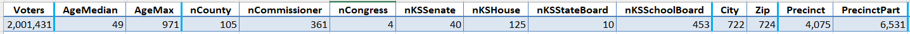
    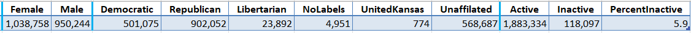

        Notes:

        * For the last year Kansas has had over 2 million voters with a median age of 49 years old.

        * Voter data shows Kansas' oldest voter is 971 years old, born in 1054. (Oops, that should have been 1954 but has never been corrected.)

        * Kansas has 105 counties, 4 congresional districts, 40 state sentate districts, 125 state house districts, 10 board of education districts.

        * Data show 361 county commission districts and 453 school districts. (I'd like to verify all that.)

        * Kansans are assigned to 4075 precincts for voting. Precinct parts (6531) divide some precincts by school district.

        * Kansas' overall inactive voter rate of 5.9% is good.

* **County**:  [`Kansas-Counts-County-yyyy-mm-dd.xlsx` (105)](2025-05-02/1-First-Look/Kansas-Counts-County-2025-05-02.xlsx)

    Selected columns
    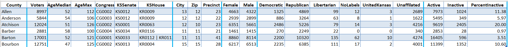

        Notes:

        * Allen County has 13 cities, 12 zip codes, and 23 precincts.

        * Three counties shown above have voters older than any known human, Atchison (126), Barton (121), Bourbon (125).

        * Inactive rates (far right column) range from 0% in Meade County to 20% in Atchison County

* **Precinct**: [`Kansas-Counts-Precinct-yyyy-mm-dd.xlsx` (4075)](2025-05-02/1-First-Look/Kansas-Counts-Precinct-2025-05-02.xlsx)

    Selected columns
    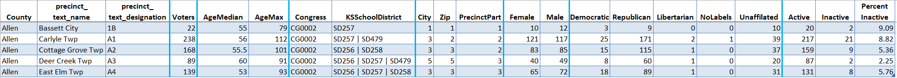

        Notes:

        * Most district information is the same within a precinct, but school districts can be divided into "precint parts."

        * Allen County, Carlyle Township precinct has two school districts (SD257 and SD479) divided by 2 precinct parts (not shown).

        * Inactive rates for very small precincts can often be 0% or 100%.

    Precincts with 30% or higher inactive rates with 50 or more voters:
    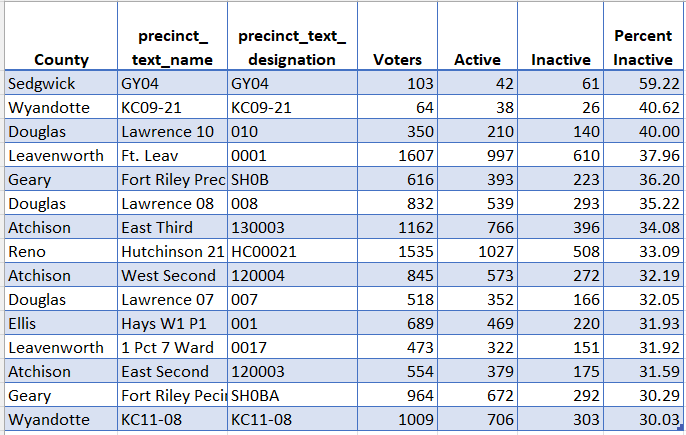

Stats include

* region name (county or precinct files)

* total voters

* age quantiles

* district numbers (county or precinct files), or counts of districts (state file)

* city, zip and precinct counts

* counts of email addresses, phone numbers

* estimates of number of households

* counts and percentages by gender

* counts and percentages by political party

* counts and percentages by active/inactive status

## Age issues

* $$\lt$$ 18 years old:  [`Kansas-Age-Too-Young-yyyy-mm-dd-Edited.xlsx`](2025-05-02/1-First-Look/Kansas-Age-Too-Young-2025-05-02-Edited.xlsx) (2)

* $$\ge$$ 105 years old:  [`Kansas-Age-Too-Old-yyyy-mm-dd-Edited.xlsx`](2025-05-02/1-First-Look/Kansas-Age-Too-Old-2025-05-02-Edited.xlsx) (308)

* [`Kansas-Crosstab-BirthYear-by-BirthMonth-yyyy-mm-dd.xlsx`](2025-05-02/1-First-Look/Kansas-Crosstab-BirthYear-by-BirthMonth-2025-05-02.xlsx)

Birth years before ~1915 are suspect (e.g., 1054 should be 1954).

* [`Kansas-Crosstab-RegisterYear-by-RegisterMonth-yyyy-mm-dd.xlsx`](2025-05-02/1-First-Look/Kansas-Crosstab-RegisterYear-by-RegisterMonth-2025-05-02.xlsx)

Registration years before 1960 are suspect. One registration in the future is an error.

## Household issues

A "household" is a common address shared by a group of voters, often families but sometimes dormitories.

Lists below show households with the top 0.1% number of voters (descending sort).

### Street Addresses

* [`Kansas-Households-Address-to-Explore-for-Many-Voters-yyyy-mm-dd.xlsx`](2025-05-02/1-First-Look/Kansas-Households-Address-to-Explore-for-Many-Voters-2025-05-02.xlsx) (1181)

Top 10

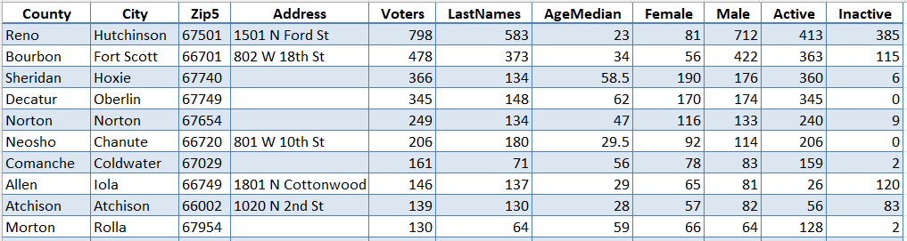

"1501 N Ford St" is the address of the Hutchinson Community College, where at least 385 students no longer reside.

### Mailing Addresses

* [`Kansas-Households-Mail-to-Explore-for-Many-Voters-yyyy-mm-dd.xlsx`](2025-05-02/1-First-Look/Kansas-Households-Mail-to-Explore-for-Many-Voters-2025-05-02.xlsx) (133)

Top 10

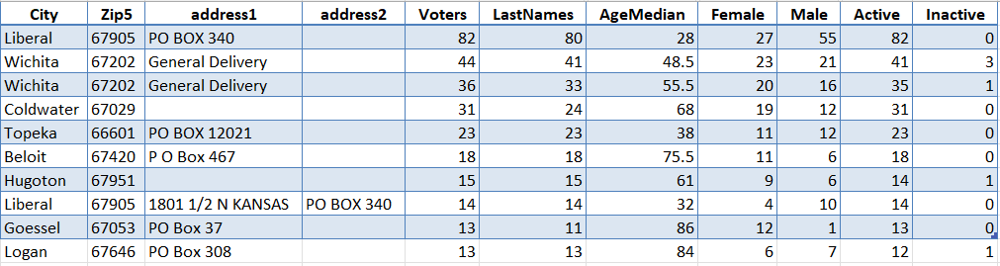

"PO Box 340" in Liberal is the Seward County Community College.

## Election Codes

Voter history is recorded with a code, which has been standardized statewide in recent years. Interpreting many old codes is difficult.

Counts of numbers of voters and counties using election codes (sorted in descending order):

**File**:  [`Kansas-Election-Code-Summary-yyyy-mm-dd.xlsx`](2025-05-02/1-First-Look/Kansas-Election-Code-Summary-2025-05-02.xlsx)  (1256)

Top 10

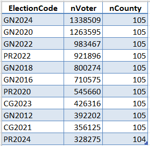

Notes

* Code prefix "GN" is for general election, "PR" for primary election, in even-numbered years.

* Code "CG" used to mean "City General" election but now means a local election in odd-numbered years.

* The 11th most common code above (PR2024) shows one county still has not reported voter history for the 2024 primary election!

## `Counts` folder

Each of about 80 data fields has a file with frequency counts of values.

Some files with personal identifiable information (PII) have been withheld. Some very large files are not included.

Note:

* `004-text_name_first.csv` shows 8 people without first names.
* `020-cde_res_state.csv` shows 17 Kansas voters have a zip code split with Nebraska

# 2. Age-Gender-Party breakdown

Parametric RStudio computational notebook reports create graphics for each geography (GEONAME).

* [`Age-Gender-Party-Driver.html`](2025-05-02/2-Age-Gender-Party/Age-Gender-Party-Driver.html) (results of processing)

* `Age-Gender-Party-Driver.Rmd`

* `Age-Gender-Party-Template.Rmd`

## Kansas statewide

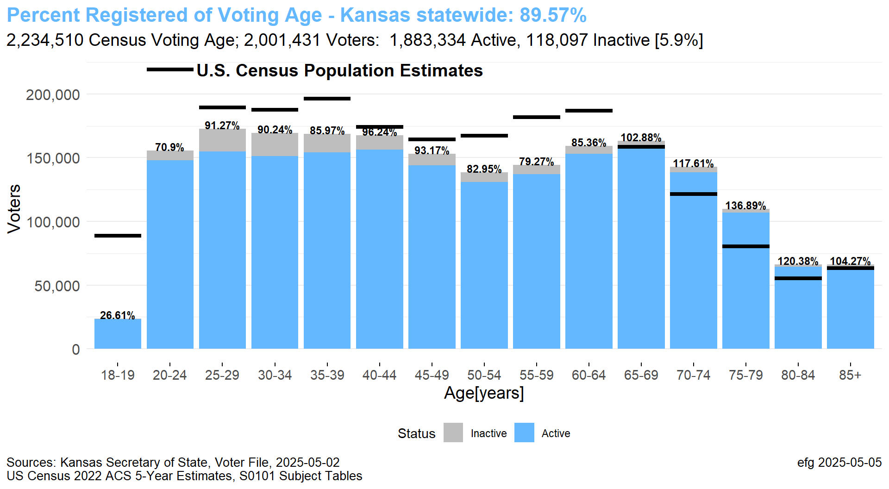

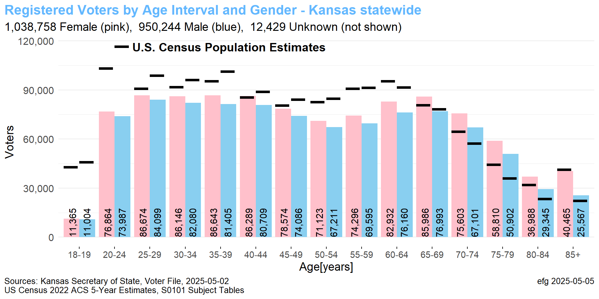

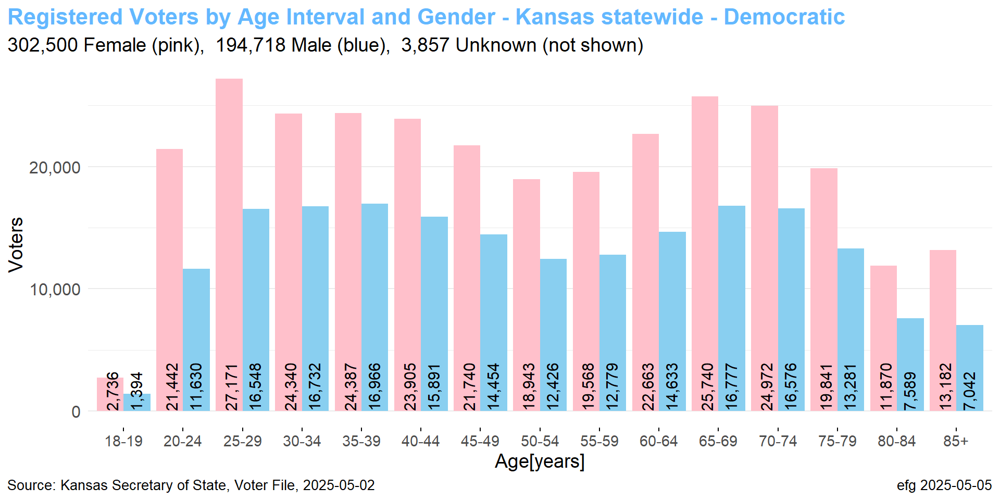

## Johnson County

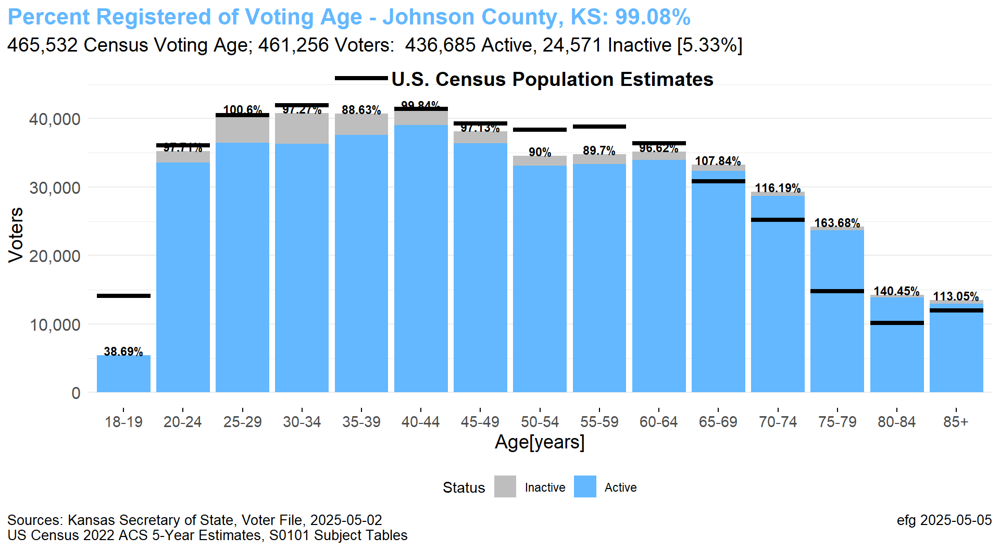

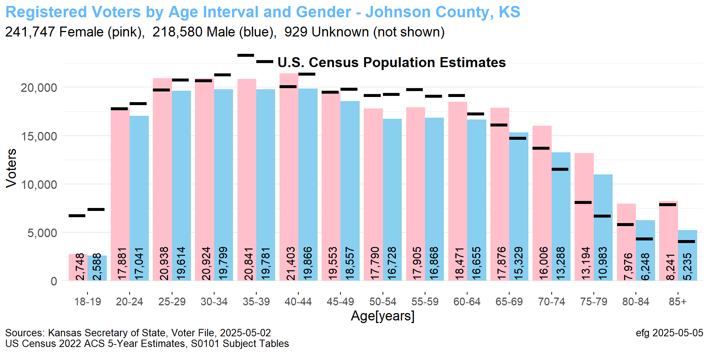

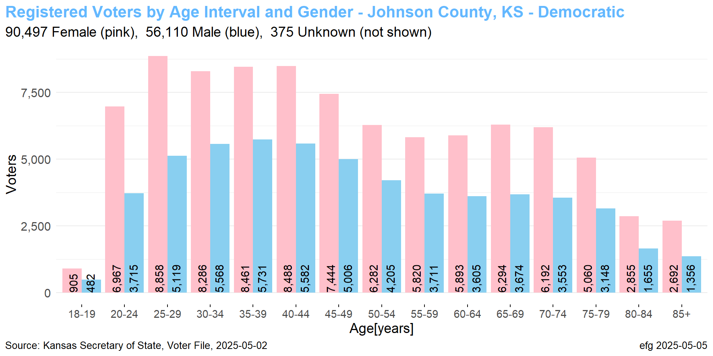

Currently charts are only available for Kansas statewide and four counties (Douglas, Johnson, Sedgwick, Shawnee).

Eventually all 105 counties will have separate directories.

# 3. Active-Inactive Voters

An RStudio computational notebook shows results of analyzing active/inactive voter registrations and plots a map by county:

**File**: [`Map-Kansas-Inactive-Voters.html`](2025-05-02/3-Active-Inactive/Map-Kansas-Inactive-Voters.html)

List of 105 counties with total voters and active and inactive counts:

[`Kansas-Active-Inactive-Voters.xlsx`](2025-05-02/3-Active-Inactive/Kansas-Active-Inactive-Voters.xlsx) (105)

County Map

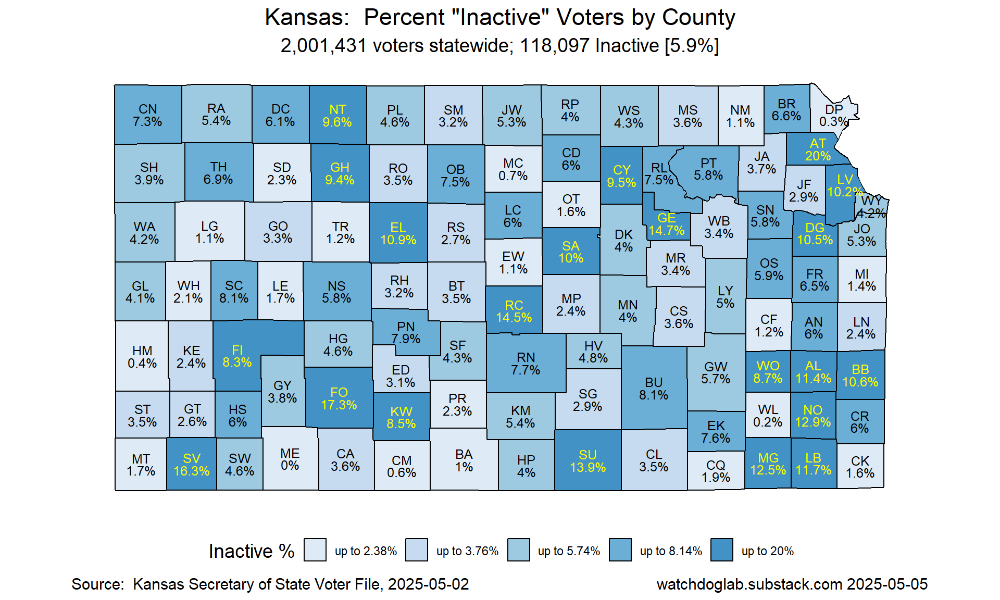

Recent article: [Kansas had over 140,000 inactive voters in Jan. 2024 but only 113,000 in Jan. 2025. Inactive rates in some counties are still fairly high.](https://watchdoglab.substack.com/p/kansas-has-27000-fewer-inactive-voters)

Notes:

* "Edited" in a filename often indicates some personal identifiable information has been removed.

* Most filenames end with time stamp (yyyy-mm-dd) of voter file release (which enables comparisons of multiple versions in Excel).
